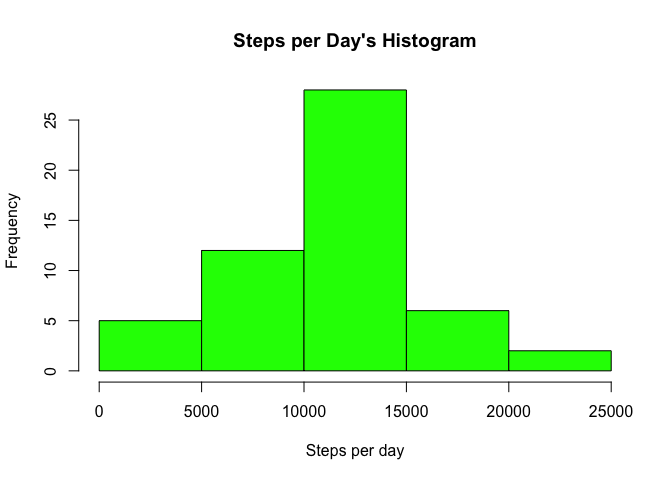
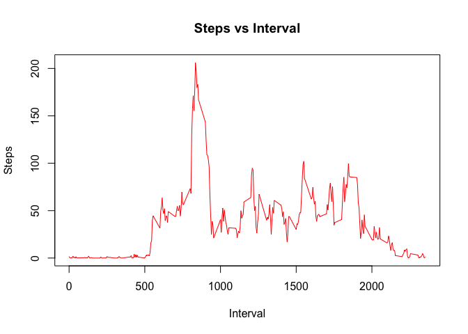
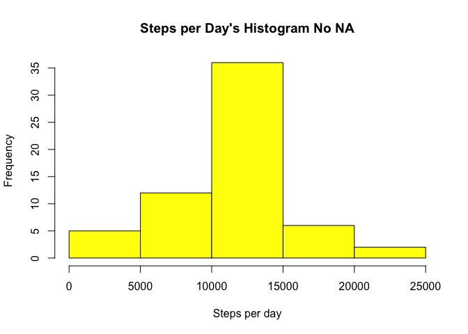

# Reproducible Research: Peer Assessment 1
Henrry Nadal  
April 20th, 2016  


## Loading and preprocessing the data


```r
library(lattice) 
library(chron) 
```


```r
temp <- tempfile() 
url<-"https://d396qusza40orc.cloudfront.net/repdata%2Fdata%2Factivity.zip"
download.file(url, temp, method="curl")
contain<-unz(temp, "activity.csv") 
Data<-read.csv(contain) 
Data$steps<-as.numeric(Data$steps) 
Data$date<-as.Date(Data$date)
```


## What is mean total number of steps taken per day?

For this part of the assignment, you can ignore the missing values in the
dataset.

Calculate the total number of steps taken per day


```r
Steps<-aggregate(x=Data$steps, by=list(Data$date), FUN=sum, na.rm=F) 
names(Steps)<-c("Date", "Steps_per_day") 
Steps 
```

```
##          Date Steps_per_day
## 1  2012-10-01            NA
## 2  2012-10-02           126
## 3  2012-10-03         11352
## 4  2012-10-04         12116
## 5  2012-10-05         13294
## 6  2012-10-06         15420
## 7  2012-10-07         11015
## 8  2012-10-08            NA
## 9  2012-10-09         12811
## 10 2012-10-10          9900
## 11 2012-10-11         10304
## 12 2012-10-12         17382
## 13 2012-10-13         12426
## 14 2012-10-14         15098
## 15 2012-10-15         10139
## 16 2012-10-16         15084
## 17 2012-10-17         13452
## 18 2012-10-18         10056
## 19 2012-10-19         11829
## 20 2012-10-20         10395
## 21 2012-10-21          8821
## 22 2012-10-22         13460
## 23 2012-10-23          8918
## 24 2012-10-24          8355
## 25 2012-10-25          2492
## 26 2012-10-26          6778
## 27 2012-10-27         10119
## 28 2012-10-28         11458
## 29 2012-10-29          5018
## 30 2012-10-30          9819
## 31 2012-10-31         15414
## 32 2012-11-01            NA
## 33 2012-11-02         10600
## 34 2012-11-03         10571
## 35 2012-11-04            NA
## 36 2012-11-05         10439
## 37 2012-11-06          8334
## 38 2012-11-07         12883
## 39 2012-11-08          3219
## 40 2012-11-09            NA
## 41 2012-11-10            NA
## 42 2012-11-11         12608
## 43 2012-11-12         10765
## 44 2012-11-13          7336
## 45 2012-11-14            NA
## 46 2012-11-15            41
## 47 2012-11-16          5441
## 48 2012-11-17         14339
## 49 2012-11-18         15110
## 50 2012-11-19          8841
## 51 2012-11-20          4472
## 52 2012-11-21         12787
## 53 2012-11-22         20427
## 54 2012-11-23         21194
## 55 2012-11-24         14478
## 56 2012-11-25         11834
## 57 2012-11-26         11162
## 58 2012-11-27         13646
## 59 2012-11-28         10183
## 60 2012-11-29          7047
## 61 2012-11-30            NA
```

If you do not understand the difference between a histogram and a barplot,
research the difference between them. Make a histogram of the total number of
steps taken each day


```r
hist(Steps$Steps_per_day, col="green", xlab="Steps per day", 
     main="Steps per Day's Histogram") 
```




Calculate and report the mean and median of the total number of steps taken per
day


```r
MMNA<-data.frame(mean=mean(Steps$Steps_per_day,
na.rm=T),median=median(Steps$Steps_per_day, na.rm=T)) 
```


## What is the average daily activity pattern?

Make a time series plot (i.e. type = "l") of the 5-minute interval (x-axis) and
the average number of steps taken, averaged across all days (y-axis)


```r
Step_day_inter<-with(Data,aggregate(x=steps, by=list(interval), FUN=mean,na.rm=T))
names(Step_day_inter)<-c("interval","Steps") 
with(Step_day_inter,plot(interval, Steps, type="l", col="red", xlab="Interval", 
                         ylab="Steps",main="Steps vs Interval"))
```




Which 5-minute interval, on average across all the days in the dataset, contains
the maximum number of steps?


```r
Step_day_inter[Step_day_inter$Steps==max(Step_day_inter$Steps),] 
```

```
##     interval    Steps
## 104      835 206.1698
```


##Imputing missing values


Note that there are a number of days/intervals where there are missing values
(coded as NA). The presence of missing days may introduce bias into some
calculations or summaries of the data.

Calculate and report the total number of missing values in the dataset (i.e. the
total number of rows with NAs)


```r
sum(is.na(Data$steps)) 
```

```
## [1] 2304
```


Devise a strategy for filling in all of the missing values in the dataset. The
strategy does not need to be sophisticated. For example, you could use the
mean/median for that day, or the mean for that 5-minute interval, etc.


```r
# We'll calculatelimit that's the number of NA's in Data and DataNa 
# that's a logical vector 
        limit<-sum(is.na(Data$steps)) 
        DataNA<-is.na(Data$steps)

# We'll implement a loop to change NA's for the mean for that 5-minute interval 
for (i in 1:limit){
        # First we'll check the 5-minute interval for each NA 
        IntervalNA<-Data[DataNA,3][i]

        # Then we'll create a logical vector with true in the Step_day_inter's 
        # index where the IntervalNA is located
        Index<-IntervalNA==Step_day_inter$interval

        # Now we'll extract the mean value for that IntervalNA 
        ToNa<-Step_day_inter[Index,2]

        # To finish we'll asign this value to the NA 
        Data[DataNA,1][i]<-ToNa 
        } 
```


Create a new dataset that is equal to the original dataset but with the missing
data filled in.


```r
head(Data)
```

```
##       steps       date interval
## 1 1.7169811 2012-10-01        0
## 2 0.3396226 2012-10-01        5
## 3 0.1320755 2012-10-01       10
## 4 0.1509434 2012-10-01       15
## 5 0.0754717 2012-10-01       20
## 6 2.0943396 2012-10-01       25
```


Make a histogram of the total number of steps taken each day and Calculate and
report the mean and median total number of steps taken per day. Do these values
differ from the estimates from the first part of the assignment? What is the
impact of imputing missing data on the estimates of the total daily number of
steps?


```r
Steps_No_NA<-aggregate(x=Data$steps, by=list(Data$date), FUN=sum, na.rm=F) 
names(Steps_No_NA)<-c("Date", "Steps_per_day") 
hist(Steps_No_NA$Steps_per_day, col="yellow", xlab="Steps per day", 
     main="Steps per Day's Histogram No NA") 
```




```r
MMNNA<-data.frame(mean=mean(Steps_No_NA$Steps_per_day,na.rm=TRUE),
           median=median(Steps_No_NA$Steps_per_day, na.rm=TRUE)) 
```


The values differ from the stimatefrom the first part of the assignment as we show next


```r
MMNNA-MMNA
```

```
##   mean   median
## 1    0 1.188679
```

So we can see that taking some vales instead of the NA's  really impact on the estimates 


##Are there differences in activity patterns between weekdays and weekends?


For this part the weekdays() function may be of some help here. Use the dataset
with the filled-in missing values for this part.

Create a new factor variable in the dataset with two levels ??? ???weekday???
and ???weekend??? indicating whether a given date is a weekday or weekend day.


```r
Weekend<-factor(is.weekend(Data$date), labels=c("weekday", "weekend")) 
Final<-data.frame(Data,Weekend)
```


Make a panel plot containing a time series plot (i.e. type = "l") of the
5-minute interval (x-axis) and the average number of steps taken, averaged
across all weekday days or weekend days (y-axis). See the README file in the
GitHub repository to see an example of what this plot should look like using
simulated data


```r
Step_day_inter_Weekday<-with(Final,aggregate(x=steps, by=list(interval, Weekend),
                                             FUN=mean,na.rm=T))
names(Step_day_inter_Weekday)<-c("interval","weekday", "steps") 
xyplot(steps~interval | weekday, data=Step_day_inter_Weekday, 
       layout=c(1,2) , type='l' )
```


